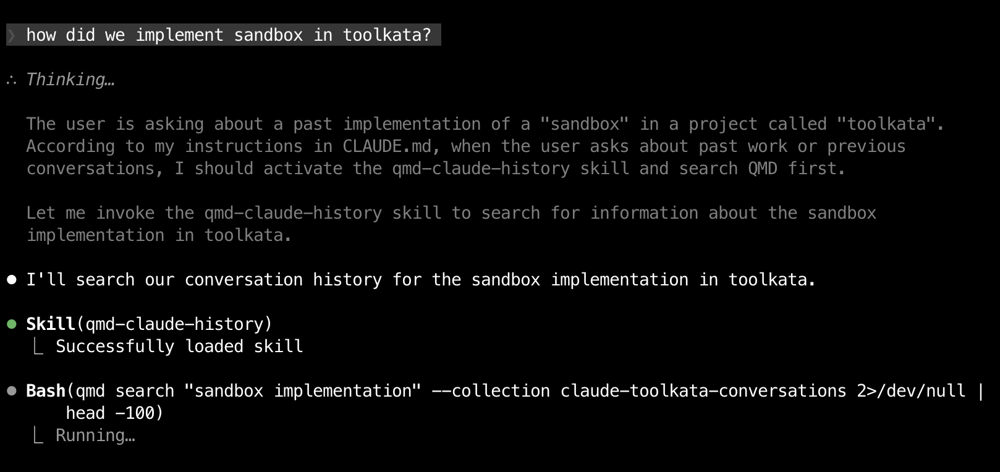

# QMD Claude History

Automatic indexing and search for Claude Code conversation history using QMD.

## What This Does

Converts Claude's JSONL conversation history into searchable Markdown collections. Each project gets its own QMD collection that Claude can search when you ask about past work.

## Features

- **Auto-activation** - Skill activates when you ask about past work (no commands needed)
- **Per-project collections** - Each project gets its own searchable history
- **Auto-conversion** - New conversations converted automatically every 30 minutes
- **Incremental updates** - Only new/changed files are processed
- **Semantic search** - Use `--semantic` flag for conceptual queries
- **96% token reduction** - Returns snippets instead of full files

## Installation

### Quick Install

```bash
curl -fsSL https://raw.githubusercontent.com/hmemcpy/qmd-claude-history/main/install.sh | bash
```

The installer runs in **4 steps**:
1. **Prerequisites check** - Verifies Bun, QMD, and jq are installed
2. **Skill installation** - Installs the qmd-claude-history skill
3. **LaunchAgent setup** - Configures automatic updates every 30 minutes
4. **CLAUDE.md configuration** (optional) - Adds skill activation directive to your global CLAUDE.md

**Note on Step 4:** The installer will show you a preview of the text to be added to `~/.claude/CLAUDE.md` and ask for confirmation. This step is **optional but recommended** - it enables automatic skill activation when you ask about past work. You can:
- **Yes** - Add the directive (recommended)
- **No** - Skip this step (you'll need to manually activate the skill)
- **View** - See the full text before deciding

### Manual Install

```bash
git clone https://github.com/hmemcpy/qmd-claude-history.git
cd qmd-claude-history
./install.sh
```

### Prerequisites

**1. Install Bun** (if not already installed)
```bash
curl -fsSL https://bun.sh/install | bash
```

**2. Install QMD**
```bash
bun install -g https://github.com/tobi/qmd
```

On macOS, also install SQLite for extension support:
```bash
brew install sqlite
```

**3. Install jq**
```bash
brew install jq
```

**4. Verify installation**
```bash
qmd status      # Should show index and collections
which qmd       # Should show ~/.bun/bin/qmd
which jq         # Should show /usr/local/bin/jq or similar
```

**Note:** QMD will automatically download GGUF models (~2GB total) on first use:
- Embedding model: ~300MB
- Reranker model: ~640MB
- Query expansion model: ~1.1GB

## Usage

Once installed, Claude will automatically search its own conversation history when you ask about past work. **No commands needed** - just ask naturally!

### Automatic Activation

The skill activates when you ask things like:
- "What did we work on last week?"
- "How did I implement X?"
- "Remind me about the Y project"
- "What was our approach to Z?"



*Example: Claude automatically activates the qmd-claude-history skill and searches conversation history when asked about past work*

### Manual Search

For precise control, use direct QMD commands:

```bash
# Search current project's history
/qmd "how did we implement authentication" --collection claude-myproject-conversations

# Search with semantic matching
/qmd "deployment process" --semantic --collection claude-myproject-conversations

# Search across all projects
/qmd "docker setup"
```

### Manual Update

If you need to update immediately (normally runs every 30 min automatically):

```bash
convert-claude-history.sh && qmd update && qmd embed
```

## How It Works

1. **Skill** (`~/.claude/skills/qmd-claude-history/SKILL.md`) teaches Claude when and how to search history
2. **Converter** (`convert-claude-history.sh`) extracts conversations from `~/.claude/projects/`
3. **LaunchAgent** runs the converter every 30 minutes automatically
4. **QMD collections** are created per-project for fast searching
5. **Auto-activation** - Claude loads the skill automatically when you ask about past work

## CLAUDE.md Configuration

The installer can optionally add a directive to your global `~/.claude/CLAUDE.md` file. This is **recommended** because:

- **Enables automatic skill activation** when you ask about past work
- **No manual intervention needed** - Claude knows to search history automatically
- **Works immediately** - No need to remember to activate the skill

### What Gets Added

```markdown
## Memory & Context Retrieval

When the user asks about past work, previous conversations, or anything that might be in conversation history, **activate the qmd-claude-history skill** and search QMD first before answering.

### When to Search History

Activate qmd-claude-history skill when user asks:
- "What did we work on last week?"
- "How did I implement X?"
- "Remind me about the Y project"
- "What was our approach to Z?"
- "Did we discuss...?"
- Any question referencing past work or conversations
```

### If You Skipped This Step

You can add it later by running the installer again, or manually add the section above to your `~/.claude/CLAUDE.md` file.

**Without this directive:** You'll need to manually tell Claude to "activate the qmd-claude-history skill" before asking about past work.

## Project Structure

```
~/.claude/
├── projects/                    # Claude's original JSONL history
├── converted-history/           # Converted Markdown files
│   ├── myproject/
│   │   ├── 2026-01-31-session1.md
│   │   └── 2026-01-30-session2.md
│   └── otherproject/
├── plans/                       # Claude's plan documents (also indexed)
└── skills/
    └── qmd-claude-history/
        └── SKILL.md             # This skill's instructions
```

## Collection Naming

Collections follow the pattern: `claude-<project-name>-conversations`

Example projects:
- `claude-toolkata-conversations`
- `claude-scrolltunes-conversations`
- `claude-myapp-conversations`

## Search Strategy

| Type | Command | Best For |
|------|---------|----------|
| **BM25** | `/qmd <query>` | Specific terms, keywords, file names |
| **Semantic** | `/qmd <query> --semantic` | Concepts where wording varies |
| **Hybrid** | `qmd query "<query>"` | Maximum recall (slower) |

## Troubleshooting

### LaunchAgent not running?

```bash
launchctl list | grep qmd-claude-history
launchctl load ~/Library/LaunchAgents/com.user.qmd-claude-history.plist
```

### Missing collections?

```bash
# Re-run conversion and indexing
convert-claude-history.sh
qmd collection list
qmd embed
```

### Clear and rebuild all

```bash
rm -rf ~/.claude/converted-history
convert-claude-history.sh
# Then recreate collections manually
```

## Uninstall

```bash
./uninstall.sh
```

Or manually:

```bash
launchctl unload ~/Library/LaunchAgents/com.user.qmd-claude-history.plist
rm ~/Library/LaunchAgents/com.user.qmd-claude-history.plist
rm ~/.local/bin/convert-claude-history.sh
rm -rf ~/.claude/skills/qmd-claude-history
# Optional: remove converted history
rm -rf ~/.claude/converted-history
```

## License

MIT
